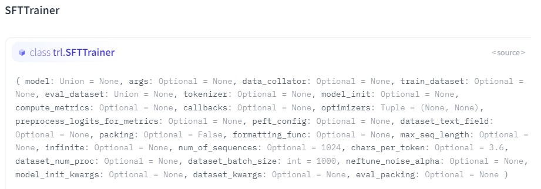

# SFT(Supervised Fine-tuning) Trainer

1. RLHF에서 중요한 과정.

- huggingface에서 제공하는 flexible example [https://github.com/huggingface/trl/blob/main/examples/scripts/sft.py]

## Parameters

### Quickstart

'''
from datasets import load_dataset
from trl import SFTTrainer

dataset = load_dataset("imdb", split="train")

trainer = SFTTrainer(
    "facebook/opt-350m",
    train_dataset=dataset,
    dataset_text_field="text",
    max_seq_length=512,
)
trainer.train()
'''